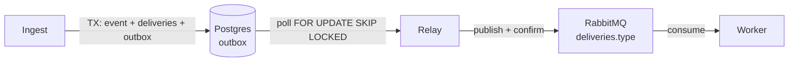
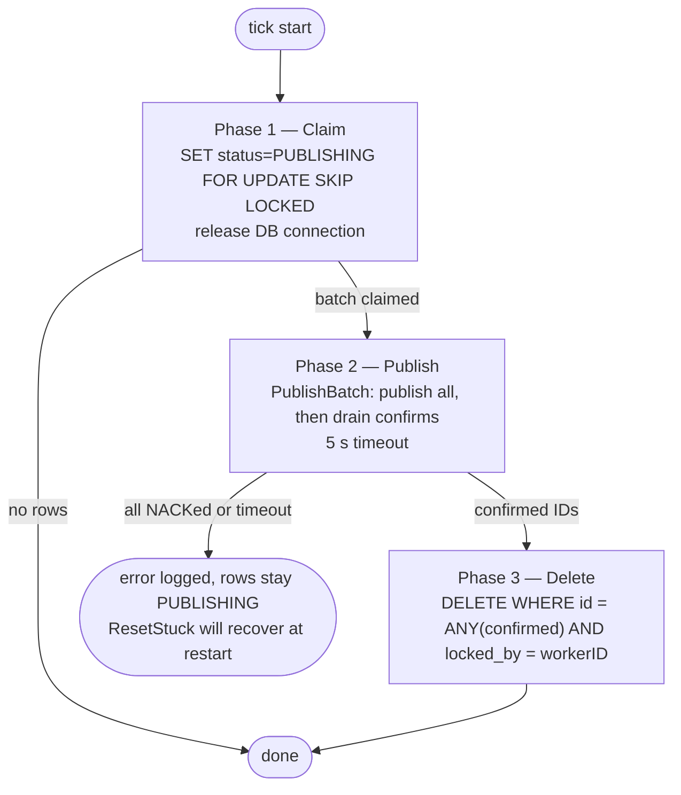
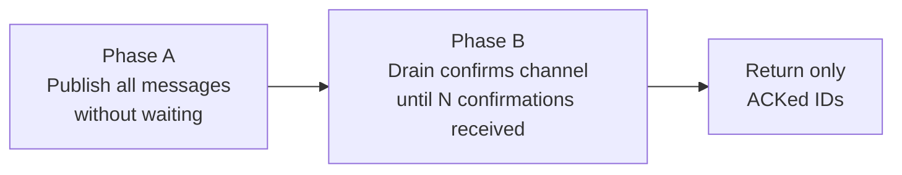
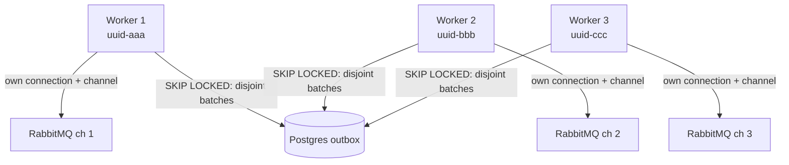
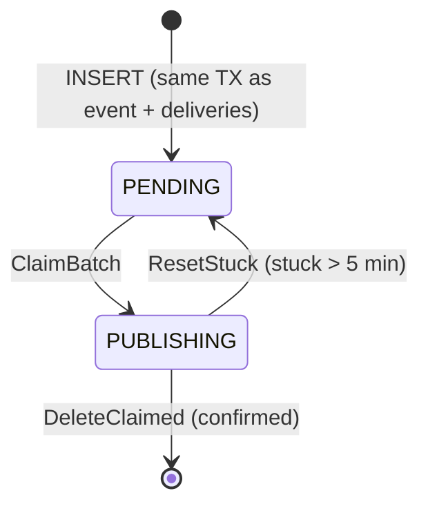

# How the Relay Works

> For RabbitMQ fundamentals (exchanges, queues, publisher confirms, DLX) see [infra.md](infra.md).
> For the worker that consumes from RabbitMQ see [worker.md](worker.md).

## Why the relay exists

You cannot atomically commit to Postgres and publish to RabbitMQ in a single transaction. Without the relay, a crash between the DB write and the AMQP publish would silently drop an event.

The solution is the **transactional outbox pattern**: the ingest path writes outbox rows atomically with the event and delivery records. The relay is a separate process that reads those rows and moves them into RabbitMQ, deleting each row only after the broker confirms receipt.



## The Three-Phase Tick

Every `poll_ms` milliseconds each relay worker runs `tick()`, which is strictly three phases. The DB connection is held only during phases 1 and 3 — never during the AMQP round-trip.



> If the relay crashes between phases 2 and 3, rows remain `PUBLISHING`. `ResetStuck` resets them to `PENDING` on the next startup. See [Crash Recovery](#crash-recovery).

### Phase 1 — Claim

`outbox.ClaimBatch` runs a single CTE:

```sql
WITH claimed AS (
    SELECT id FROM outbox
    WHERE status = 'PENDING'
    ORDER BY created_at ASC
    LIMIT $batchSize
    FOR UPDATE SKIP LOCKED
)
UPDATE outbox
SET status = 'PUBLISHING', locked_by = $workerID, locked_at = NOW()
WHERE id IN (SELECT id FROM claimed)
RETURNING id, routing_key, payload, created_at
```

`SKIP LOCKED` means concurrent relay workers claim disjoint batches without coordination or waiting. `locked_by` scopes ownership to this worker instance (a UUID generated at startup).

### Phase 2 — Publish

`PublishBatch` runs in two sub-phases to avoid a confirm RTT per message:



**Phase A** — calls `amqpChannel.PublishWithContext` for every message in the batch without blocking on a confirm. If any publish call fails (connection drop mid-batch), the publisher reconnects and returns an error. Because a failed publish does _not_ guarantee the broker never received the message, the relay treats those rows as unconfirmed and leaves them for `ResetStuck` to recover.

**Phase B** — reads from the `NotifyPublish` confirms channel until `n` confirmations have arrived (one per published message). The broker assigns monotonically increasing delivery tags per channel; the relay uses `deliveryTag - startTag` as an index into the batch to match each confirmation to its message.

Only `Ack=true` IDs are returned. `Nack`ed messages remain in the outbox and will be retried on the next tick.

The confirms channel is pre-allocated with `confirmBufSize = 512` slots (must exceed `batchSize`) so the broker's internal goroutine never blocks while Phase A is still publishing.

### Phase 3 — Delete

`outbox.DeleteClaimed` deletes only rows this worker owns:

```sql
DELETE FROM outbox WHERE id = ANY($confirmedIDs) AND locked_by = $workerID
```

The `locked_by` guard is a safety net: if a worker restarts and `ResetStuck` has already re-claimed a row for a new worker, the old worker's stale delete is a no-op.

## Multiple Workers

Each relay worker gets its **own AMQP connection and channel**. Sharing one publisher would serialize all workers on a single channel's confirm round-trip — each `PublishBatch` call holds the publisher mutex until all confirms drain.



Workers run in an `errgroup`: if any worker returns an error (e.g., can't connect to RabbitMQ on startup), the group cancels and the process exits.

## Crash Recovery

### Stuck PUBLISHING rows

If the relay crashes or is killed between Phase 2 and Phase 3, rows are left in `PUBLISHING`. On every startup, `ResetStuck` resets rows that have been `PUBLISHING` for more than 5 minutes:

```sql
UPDATE outbox
SET status = 'PENDING', locked_by = NULL, locked_at = NULL
WHERE status = 'PUBLISHING' AND locked_at < NOW() - INTERVAL '5 min'
```

This produces at-least-once delivery: the recovered rows will be published again. Workers downstream accept at-least-once semantics — a redelivered message may result in a duplicate notification, which is harmless for this system.

### Why 5 minutes?

The `publishTimeout` for a single batch is 5 seconds. A stuck row at 5 minutes is unambiguously abandoned — not merely slow. Setting the threshold lower risks resetting rows that a slow-but-alive worker is still confirming.

## Outbox Row State Machine



NACKed rows remain `PUBLISHING` until `ResetStuck` resets them. They are not immediately retried within the same tick — the relay leaves them for the next startup recovery cycle.

## Config Knobs

| Key | Default | Effect |
|---|---|---|
| `relay.workers` | — | Number of parallel relay goroutines (each with its own AMQP connection) |
| `relay.outbox_poll_ms` | — | Polling interval per worker in milliseconds |
| `relay.batch_size` | — | Max outbox rows claimed per tick per worker |

Throughput scales roughly as `workers × (batch_size / round_trip_latency)`. Setting `batch_size` above 512 requires increasing `confirmBufSize` in `publisher.go` to match, otherwise Phase A can block the broker's internal goroutine.
