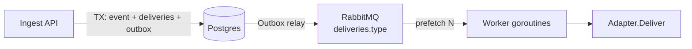
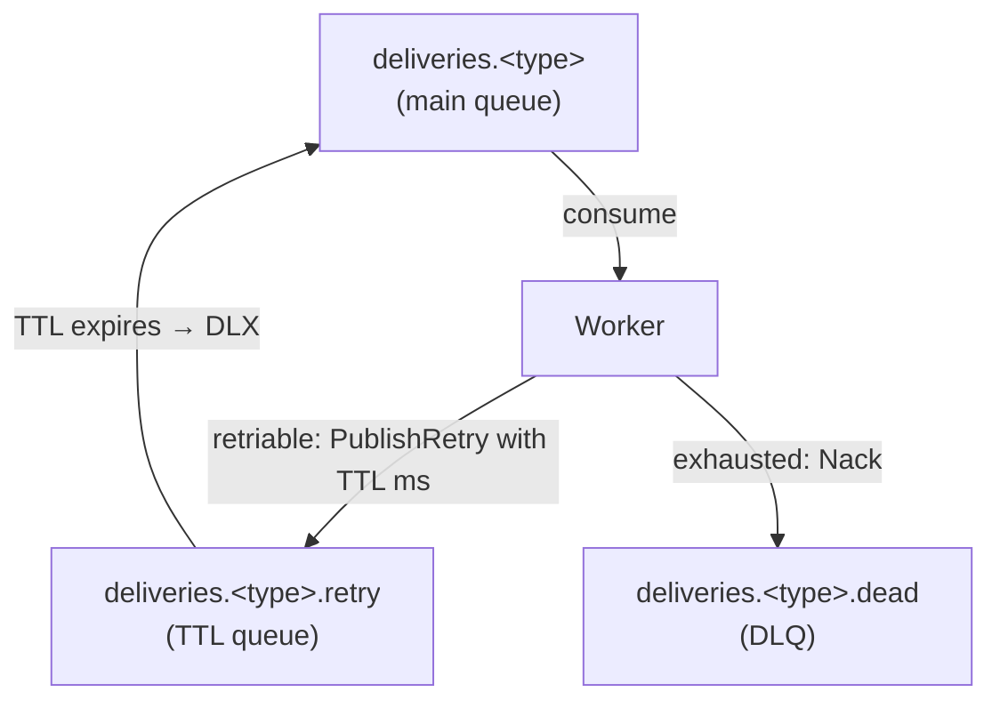
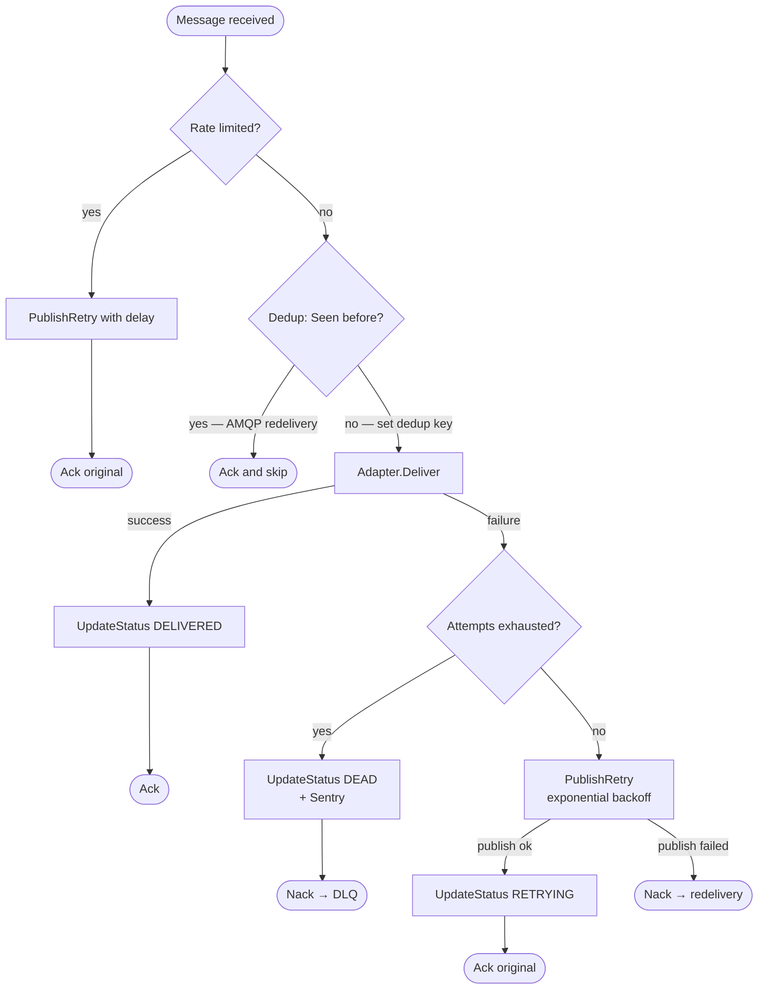

# How Workers Work

> For RabbitMQ fundamentals (exchanges, queues, Ack/Nack, DLX, at-least-once delivery) see [infra.md](infra.md).

## The Pipeline

An ingest request writes an event + delivery records + outbox rows **atomically** in one transaction. A separate relay process reads the outbox and publishes each row to RabbitMQ. Workers pick up those messages and call the actual delivery adapter (webhook, email, telegram, …).

Each channel type (`webhook`, `telegram`, …) gets its own RabbitMQ queue and its own pool of worker goroutines. Concurrency is controlled by two knobs: the number of goroutines and the AMQP prefetch count (how many unacked messages RabbitMQ hands to each goroutine at once).

## RabbitMQ Topology

Three queues per channel type:

**Retry flow:** worker publishes the message to the retry exchange with a TTL (the backoff delay). When the TTL expires, RabbitMQ's DLX routes it back to the main queue. The original message is Acked — the retry copy is now in-flight.

**Dead flow:** worker returns an error → `Reject(requeue=false)` → DLX routes to dead queue.

## Per-Message Handler Logic

For each message, the worker runs these steps in order:

> On every Nack path (exhausted retries, PublishRetry failure) the dedup key is deleted via a `defer`, so redelivery is not silently suppressed.

### 1. Rate limit check
If the adapter implements `RateLimiter`, this runs **before** dedup. If rate-limited, the message is re-queued via `PublishRetry` with the adapter-specified delay and the original is Acked. No dedup key is touched — when the message comes back, it will be processed fresh.

Why before dedup: if dedup ran first, the SetNX would consume the key for this `(deliveryID, attempt)` pair. The re-queued copy arrives with the same attempt number and would be silently dropped.

### 2. Dedup check
`Seen(deliveryID, attempt)` does a Redis `SETNX` on key `synapse:dedup:<id>:<attempt>`.

- Key not set → SetNX succeeds → process the message.
- Key already set → this is an AMQP redelivery of a message we already processed → Ack and skip.

Keying by **attempt** is intentional: a legitimate retry has a bumped attempt counter and gets a fresh key. Only true redeliveries (same attempt) are suppressed.

The dedup key is deleted if the handler returns an error (Nack path). This ensures a redelivery after a failed `PublishRetry` is not silently dropped. Fail-open on Redis errors — the handler proceeds and the PG unique constraint is the hard backstop.

### 3. Deliver
Calls `adapter.Deliver(ctx, msg)`. The `WorkerMessage` carries a snapshot of all config at fan-out time: channel config, payload, attempt counter, max attempts. Config changes after fan-out do not affect in-flight messages.

### 4. Success path
Update delivery status to `DELIVERED` in Postgres. Ack the message.

### 5. Retriable failure
Bump the attempt counter in the message, marshal it, publish to the retry exchange with exponential backoff (30s → 60s → 120s → … capped at 30 min). If the adapter signals a specific `retry_after`, use that if it's longer than the computed backoff. Update status to `RETRYING`. Ack the original.

### 6. Exhausted retries
`attempt >= maxAttempts` → capture to Sentry, update status to `DEAD`, return error → Nack → DLQ.

### Panic safety
If the handler panics (nil pointer in an adapter, bad JSON, etc.), `consumer.go` wraps the call in a `recover()`. The message is Rejected to DLQ, the panic is logged, and the goroutine continues processing the next message — the pool does not drain.

## Summary Table

| Outcome | Dedup key | Original message | Next step |
|---|---|---|---|
| Redelivery (already processed) | exists | Ack | Nothing |
| Success | stays set | Ack | Done |
| Rate limited | not set | Ack | Re-queued with delay |
| Retriable failure | deleted on Nack | Ack (after retry published) | Retry queue → back to main |
| PublishRetry failed | deleted | Nack | RabbitMQ redelivers |
| Exhausted retries | deleted on Nack | Nack | Dead queue |
